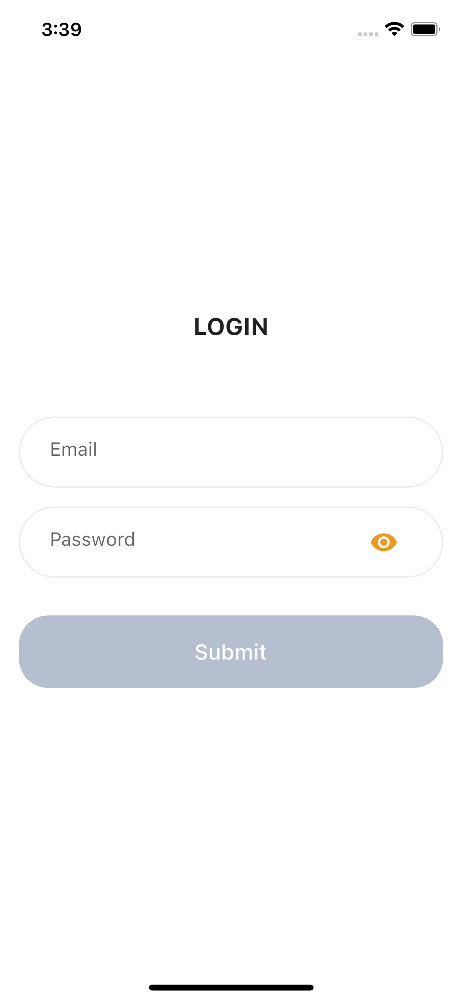
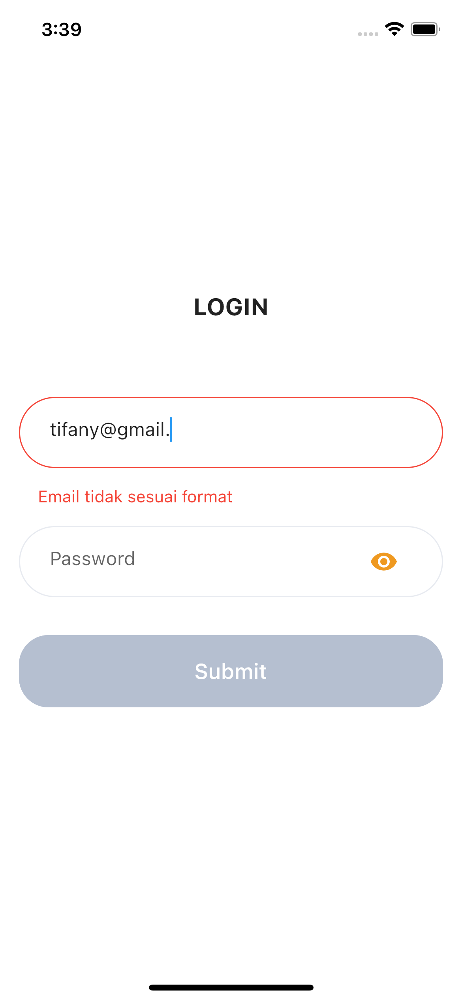
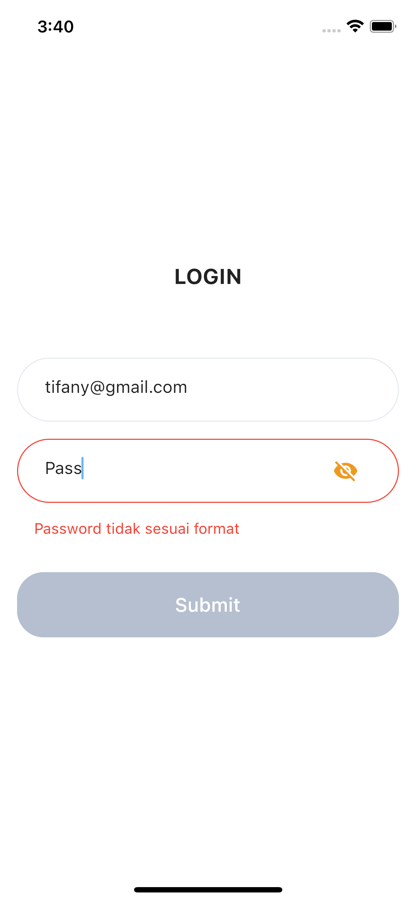
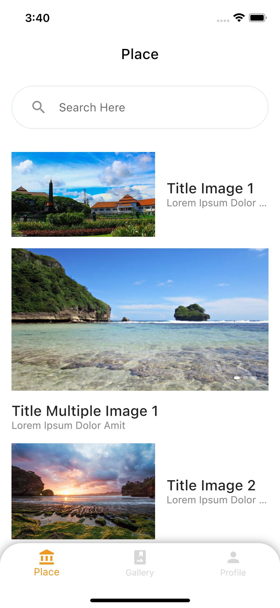
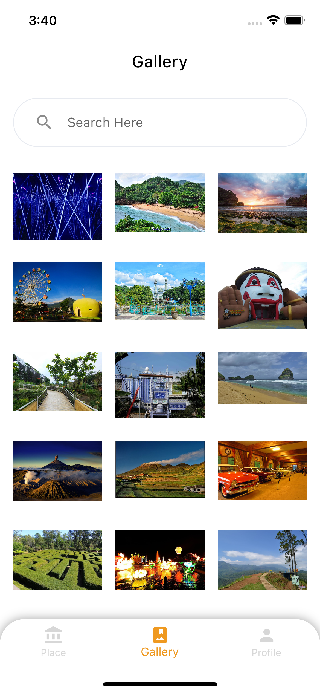
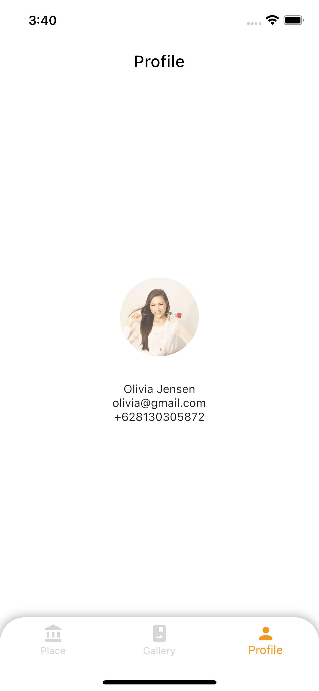

## Library yang digunakan
- [Shared Preferences](https://pub.dev/packages/shared_preferences) - Modul untuk persistent storage
- [http](https://pub.dev/packages/http) - untuk fetch data dari API

## Screenshots

